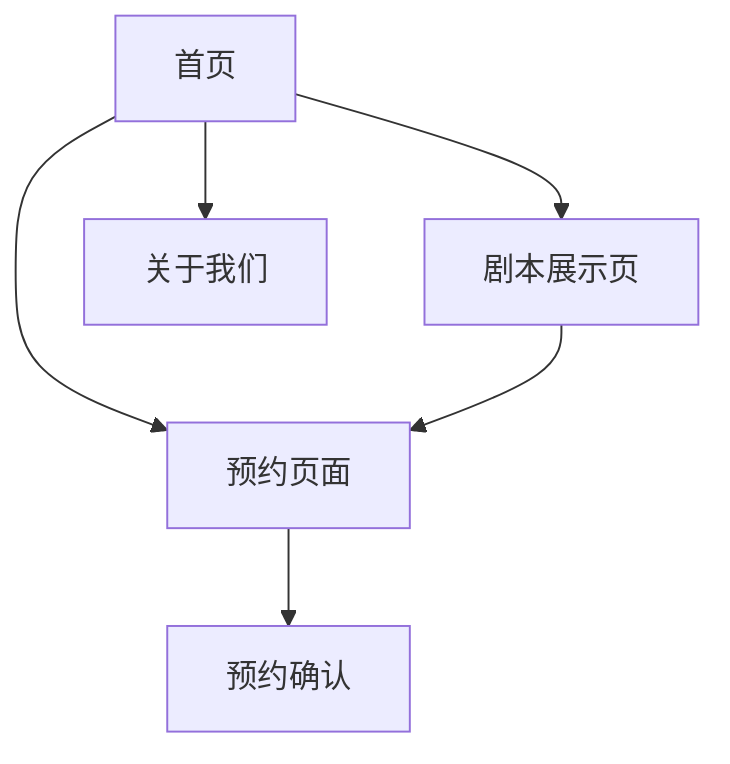

## 1. 产品概述
破茧社是一家专注于剧本杀体验的线下店铺，官网需要展现其独特的奇幻、悬疑氛围。通过3D动效和星球元素营造沉浸式体验，吸引用户了解并预约剧本杀服务。

目标用户为18-35岁喜欢剧本杀、桌游、沉浸式体验的年轻群体，网站将帮助他们了解店铺特色、查看剧本信息并便捷预约。

## 2. 核心功能

### 2.2 功能模块
破茧社官网包含以下主要页面：

1. **首页**：3D星球动画展示、店铺介绍、特色剧本推荐、预约入口
2. **剧本展示页**：剧本列表、详情介绍、难度等级、玩家人数
3. **预约页面**：剧本选择、时间预约、人数选择、联系方式填写
4. **关于我们**：店铺环境展示、团队介绍、服务理念

### 2.3 页面详情

| 页面名称 | 模块名称 | 功能描述 |
|---------|---------|---------|
| 首页 | 3D星球动画区 | 展示旋转星球、粒子效果、太空背景，营造奇幻氛围 |
| 首页 | 店铺介绍区 | 展示破茧社品牌故事、特色服务、环境照片 |
| 首页 | 热门剧本推荐 | 轮播展示3-5个热门剧本，包含封面图、简介、难度 |
| 首页 | 快速预约入口 | 醒目的预约按钮，点击跳转预约页面 |
| 首页 | 底部信息 | 店铺地址、联系方式、地图展示、营业时间 |
| 剧本展示页 | 剧本筛选 | 按类型、难度、人数筛选剧本 |
| 剧本展示页 | 剧本卡片 | 展示剧本封面、名称、类型、难度、人数、时长 |
| 剧本展示页 | 剧本详情 | 点击查看详细剧情介绍、角色设置、适合人群 |
| 预约页面 | 剧本选择 | 下拉选择或搜索想要预约的剧本 |
| 预约页面 | 时间选择 | 日期时间选择器，显示可预约时段 |
| 预约页面 | 人数选择 | 选择参与人数，显示价格计算 |
| 预约页面 | 联系信息 | 填写姓名、电话、备注信息 |
| 预约页面 | 提交确认 | 显示预约详情，发送确认通知 |
| 关于我们 | 环境展示 | 店铺内部环境照片轮播 |
| 关于我们 | 团队介绍 | DM（主持人）团队照片和介绍 |
| 关于我们 | 服务理念 | 破茧社的服务承诺和特色 |

## 3. 核心流程

### 用户浏览预约流程
用户访问首页 → 浏览3D动画和店铺介绍 → 查看推荐剧本 → 点击预约 → 选择剧本和时间 → 填写联系信息 → 提交预约 → 收到确认通知

## 4. 用户界面设计

### 4.1 设计风格
- **主色调**：深空蓝(#0B1426)、神秘紫(#6B46C1)、星光银(#C0C0C0)
- **辅助色**：宇宙黑(#000000)、霓虹粉(#FF1493)
- **按钮样式**：渐变背景+发光效果，圆角设计
- **字体选择**：未来感科技字体为主标题，思源黑体为正文
- **图标风格**：线性图标+发光效果，符合科幻主题
- **动效风格**：粒子飘散、光线流动、3D旋转

### 4.2 页面设计概述

| 页面名称 | 模块名称 | UI元素 |
|---------|---------|---------|
| 首页 | 3D星球动画区 | 中央大型旋转星球，周围小行星环绕，粒子背景，深空渐变背景 |
| 首页 | 店铺介绍区 | 卡片式布局，半透明背景，发光边框，配环境照片 |
| 首页 | 热门剧本推荐 | 横向滚动卡片，悬停放大效果，剧本封面图 |
| 首页 | 底部信息 | 地图嵌入（腾讯地图API），联系方式卡片式展示 |
| 剧本展示页 | 筛选区域 | 下拉选择器，标签式筛选按钮 |
| 剧本展示页 | 剧本网格 | 响应式网格布局，卡片悬停效果 |
| 预约页面 | 表单区域 | 分组表单，步骤指示器，实时验证 |
| 关于我们 | 团队展示 | 圆形头像，卡片翻转效果展示详细信息 |

### 4.3 响应式设计
- **桌面优先**：主要面向PC端用户，大屏幕展示3D效果最佳
- **移动端适配**：支持平板和手机访问，简化3D效果保证性能
- **触摸优化**：移动端支持手势操作，简化交互流程