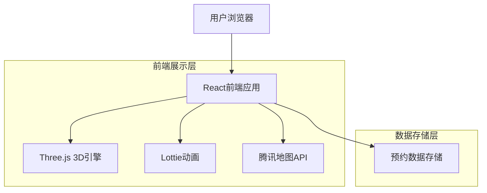

## 1. 架构设计



## 2. 技术描述

- **前端框架**：React@18 + Vite@4
- **3D渲染**：Three.js@0.158 + React Three Fiber@8
- **动画库**：Lottie React@2 + Framer Motion@10
- **UI组件**：Tailwind CSS@3 + Headless UI@1
- **地图服务**：腾讯地图JavaScript API
- **状态管理**：React Context + useReducer
- **数据存储**：浏览器本地存储(localStorage)

## 3. 路由定义

| 路由路径 | 页面用途 |
|---------|---------|
| / | 首页，展示3D动画和店铺介绍 |
| /scripts | 剧本展示页，浏览所有可选剧本 |
| /booking | 预约页面，选择剧本和时间 |
| /about | 关于我们，展示店铺环境和团队 |
| /script/:id | 剧本详情页，查看具体剧本信息 |

## 4. 核心组件设计

### 4.1 3D星球组件
```typescript
interface Planet3DProps {
  size?: number;
  rotationSpeed?: number;
  particleCount?: number;
  color?: string;
}

const Planet3D: React.FC<Planet3DProps> = ({
  size = 5,
  rotationSpeed = 0.01,
  particleCount = 1000,
  color = "#6B46C1"
}) => {
  // Three.js 星球渲染逻辑
}
```

### 4.2 预约数据接口
```typescript
interface BookingData {
  scriptId: string;
  scriptName: string;
  date: string;
  time: string;
  playerCount: number;
  customerName: string;
  customerPhone: string;
  notes?: string;
  status: 'pending' | 'confirmed';
  createdAt: string;
}

interface Script {
  id: string;
  name: string;
  coverImage: string;
  description: string;
  difficulty: 1 | 2 | 3 | 4 | 5;
  minPlayers: number;
  maxPlayers: number;
  duration: number; // 分钟
  genre: string[];
  price: number;
}
```

## 5. 动画实现方案

### 5.1 3D星球动画
- 使用Three.js创建球体几何体
- 添加纹理贴图模拟星球表面
- 实现自转和公转动画
- 周围添加粒子系统营造太空氛围
- 响应鼠标移动产生视差效果

### 5.2 Lottie动画应用
- 页面加载动画：神秘的开门效果
- 按钮交互动画：发光、脉冲效果
- 剧本卡片悬停：魔法光环效果
- 预约成功：庆祝粒子动画

### 5.3 页面过渡动画
- 使用Framer Motion实现页面切换
- 元素进入视口的渐显动画
- 滚动触发的视差效果
- 背景星空的缓慢移动

## 6. 地图集成方案

### 6.1 腾讯地图配置
```javascript
// 地图初始化
const map = new qq.maps.Map(document.getElementById('map'), {
  center: new qq.maps.LatLng(26.578343, 106.707116), // 贵阳坐标
  zoom: 16,
  mapStyleId: 'style1' // 自定义深色主题
});

// 添加标记点
const marker = new qq.maps.Marker({
  position: new qq.maps.LatLng(26.578343, 106.707116),
  map: map,
  title: '破茧社剧本杀'
});
```

### 6.2 店铺信息展示
- 地图标记点显示店铺位置
- 点击标记弹出信息窗口
- 显示详细地址和联系方式
- 提供导航功能按钮

## 7. 性能优化策略

### 7.1 3D渲染优化
- 使用LOD（细节层次）技术
- 合理的粒子数量控制
- 实现视锥体剔除
- 使用纹理压缩

### 7.2 资源加载优化
- 图片懒加载和WebP格式
- Lottie动画按需加载
- 代码分割和懒加载
- 使用React.memo优化重渲染

### 7.3 移动端适配
- 检测设备性能降级3D效果
- 触摸事件优化
- 响应式布局适配
- 减少复杂动画